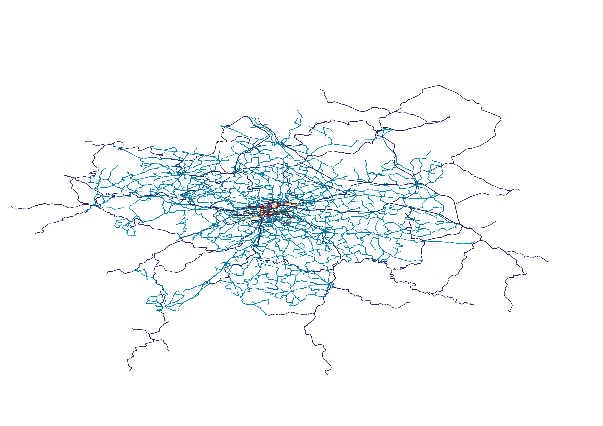
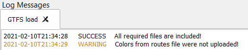

Description
---------------

Download data (ZIP file) from the `PID <https://pid.cz/o-systemu/opendata/>`__ page:

.. image:: images/download.png
   :width: 800
   
or from `TransitFeeds <https://transitfeeds.com/>`__.

In **GTFS Loader** plugin window enter path to ZIP the file:

.. image:: images/select.png
   :width: 400

.. note:: It is only possible to insert a ZIP file.

When you press **Load**, a loading bar pops up. The process can take several minutes. It depends on the amount of data.

After loading the data, the individual layers will be displayed in the layer tree and the lines of individual lines will be displayed in the map window.

Visualization:

The line colors match the PID definition and are added to the lines based on the line join with the colors defined in routes.txt.
If the colors cannot be loaded with additional information will be written in the Log Messages.

